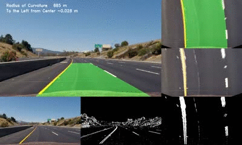
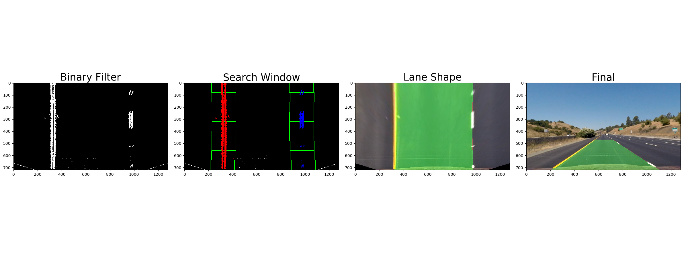
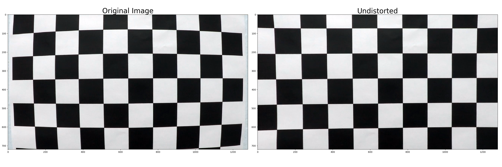
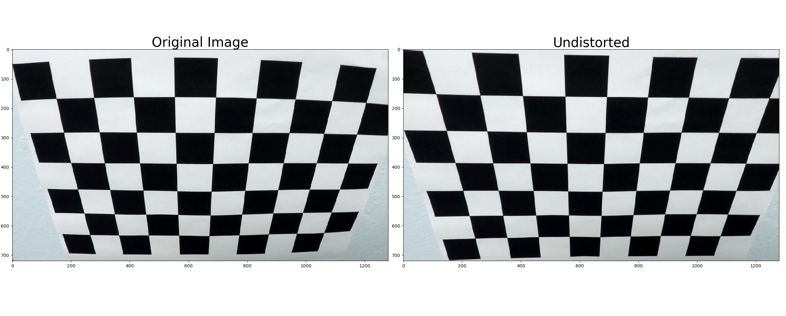
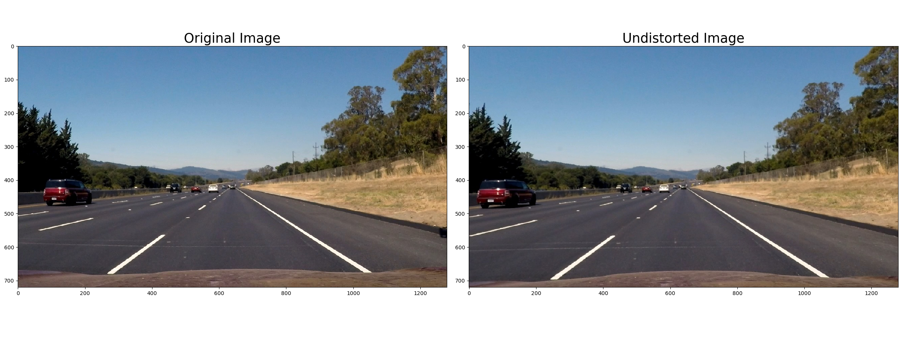
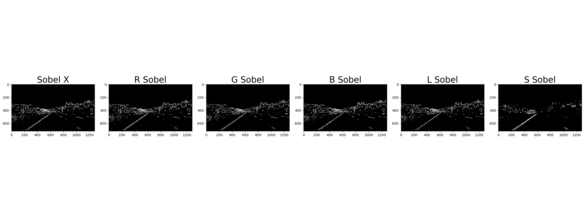
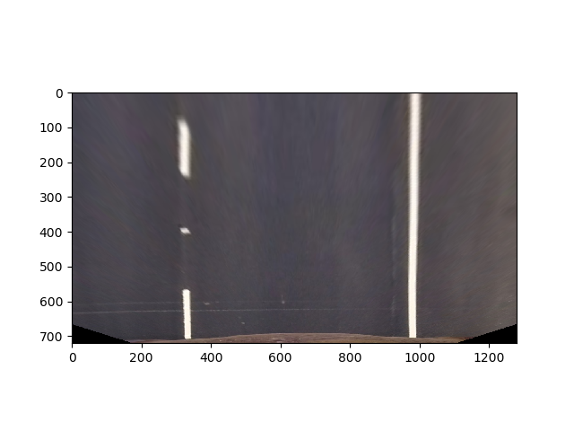
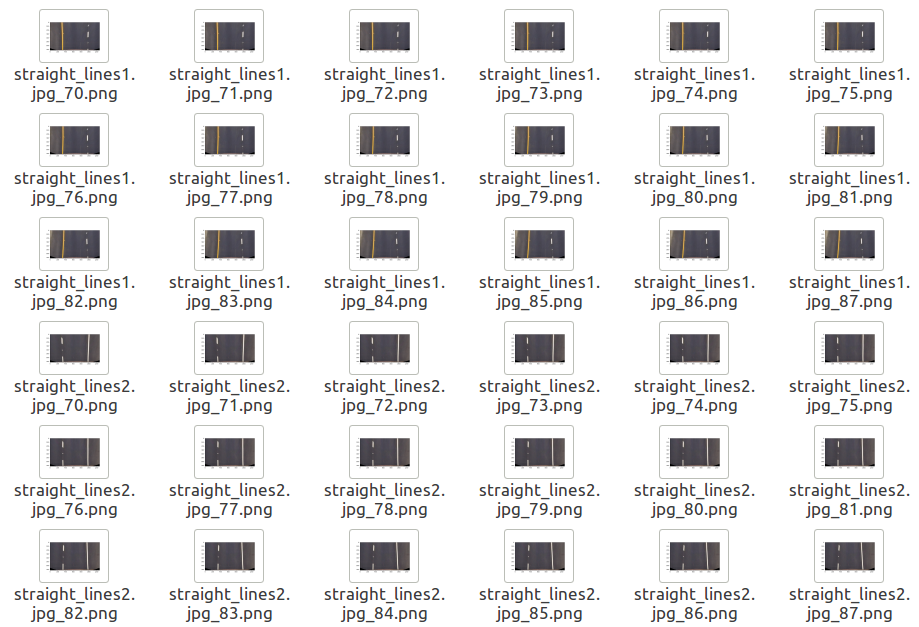
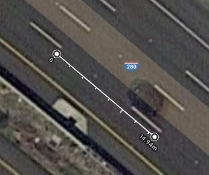
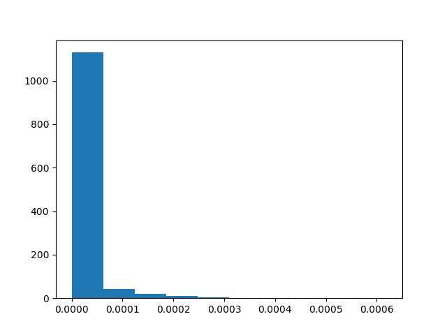

# Advanced Lane Finding Project

The goals / steps of this project are the following:

* Compute the camera calibration matrix and distortion coefficients given a set of chessboard images.
* Apply a distortion correction to raw images.
* Use color transforms, gradients, etc., to create a thresholded binary image.
* Apply a perspective transform to rectify binary image ("birds-eye view").
* Detect lane pixels and fit to find the lane boundary.
* Determine the curvature of the lane and vehicle position with respect to center.
* Warp the detected lane boundaries back onto the original image.
* Output visual display of the lane boundaries and numerical estimation of lane curvature and vehicle position.

#### Figure. 1 Pipeline sample

### Camera Calibration

* An image of the chess board taken from various angles is used to calibrate the camera. Use opencv's calibrateCamera to generate[(code)](https://github.com/BGPark/FindingLaneLineOnTheRoad2/blob/master/cal_camera.py#L33) the matrix for undistortion and save[(code)](https://github.com/BGPark/FindingLaneLineOnTheRoad2/blob/master/cal_camera.py#L14) it as pickle for later use.

* The stored matrix is used to correct radial distortion as shown below. Does it feel undistorted? The radial distortion of the camera represents the outline of the chessboard in a rounded shape, but the undistorted image is a straight line of each line.
[(Function)](https://github.com/BGPark/FindingLaneLineOnTheRoad2/blob/master/cal_camera.py#L60)
[(sample)](https://github.com/BGPark/FindingLaneLineOnTheRoad2/blob/master/cal_camera.py#L70)
 

### Pipeline
* This section describes the pipeline that processes one image. The functions generated in this process are also used to process continuous video.

#### undistortion
* Correct the radiation distortion by using the matrix calculated from the camera calibration. [(code)](https://github.com/BGPark/FindingLaneLineOnTheRoad2/blob/master/test_pipeline.py#L20)
* Unlike a chess board, it's hard to notice, but if you look at the dashboard of the car you'll notice that it's calibrated.

#### Binary combination
* There are many different ways to extract a lane from an image. I extract a lane in several color spaces centered on the Sobel operator and convert the extracted values to binary by applying  thresholds.[(code)](https://github.com/BGPark/FindingLaneLineOnTheRoad2/blob/master/utils.py#L116)

#### Perspective Transform
* To perspective transform, I extracted images by changing the offset to find the source and target position from straight lane images.[(code)](https://github.com/BGPark/FindingLaneLineOnTheRoad2/blob/master/find_trapezoid_point.py#L13) I selected 74[(code)](https://github.com/BGPark/FindingLaneLineOnTheRoad2/blob/master/utils.py#L58) as the nearest straight offset. In the following image, does the lane appear as a straight line?

* binary combination + perspective transform image is [the third image in Figure 1](https://github.com/BGPark/FindingLaneLineOnTheRoad2/blob/master/README.md#figure-1-pipeline-sample)

* The matrix is obtained as follows. [(code)](https://github.com/BGPark/FindingLaneLineOnTheRoad2/blob/master/utils.py#L52)

| Source        | Destination   | 
|:-------------:|:-------------:| 
| 650-74, 470   | 320, 0        | 
| 640+74, 720   | 960, 0        |
| 1080, 720     | 960, 720      |
| 200, 720      | 320, 720      |

#### Searching Lane line
* Please see [the second image in Figure 1](https://github.com/BGPark/FindingLaneLineOnTheRoad2/blob/master/README.md#figure-1-pipeline-sample).[(code)](https://github.com/BGPark/FindingLaneLineOnTheRoad2/blob/master/utils.py#L133) Calculate the histogram of the Y value relative to the X axis to look for the lane line. Because curves can occur, only apply to areas less than 2/3 of the full screen[(code)](https://github.com/BGPark/FindingLaneLineOnTheRoad2/blob/master/utils.py#L141). The reason for this is that the search window starts from near the vehicle[(code)](https://github.com/BGPark/FindingLaneLineOnTheRoad2/blob/master/utils.py#L167) and gradually moves forward. I move the search window by dividing the screen by 9. [(code)](https://github.com/BGPark/FindingLaneLineOnTheRoad2/blob/master/utils.py#L135) 
Set the window motion margin to 100[(code)](https://github.com/BGPark/FindingLaneLineOnTheRoad2/blob/master/utils.py#L159) and set the minimum pixel to 100[(code)](https://github.com/BGPark/FindingLaneLineOnTheRoad2/blob/master/utils.py#L161) to ignore the noise.
Since I have windows with the center of the image estimated to be lane, I use these windows to get the coefficients of lane curvature through polyfit. [(code)](https://github.com/BGPark/FindingLaneLineOnTheRoad2/blob/master/utils.py#L203)

#### Lane Curvature and center position
* Find the ratio between the perspective transformed image and the actual distance to obtain lane curvature and center position. According to the us road method, the lane spacing of the sample is interpreted as 3.7m, and one cycle of the dotted line appears as 15m. I checked that it is 15 meters by satellite view of Google Map.

* refer to the birdview image and make the following settings. 450 pixels in length is 15 meters, and a width of 650 pixels is 3.7 meters[(code)](https://github.com/BGPark/FindingLaneLineOnTheRoad2/blob/master/utils.py#L264). 

* Obtain a curve radian, and at the same time get the coordinate combination that the curve draws.[(code)](https://github.com/BGPark/FindingLaneLineOnTheRoad2/blob/master/utils.py#L256). 

* Since the left and right curves are slightly different, take the average of the two values. [(code)](https://github.com/BGPark/FindingLaneLineOnTheRoad2/blob/master/main.py#L49)

* Returns the pixel difference between the average of the X coordinates of the two lanes closest to the car and the center of the bird view. This difference value can be used to predict which direction the car loses in the lane.[(code)](https://github.com/BGPark/FindingLaneLineOnTheRoad2/blob/master/main.py#L44)

#### Overlay lane shape
* I found the line and fitted the curve for it. Now create an image shape that fills between the two lines. [(code)](https://github.com/BGPark/FindingLaneLineOnTheRoad2/blob/master/main.py#L31)

* The generated image shape has an inverse transform because it has a birdview shape. This is [the third image in Figure 1](https://github.com/BGPark/FindingLaneLineOnTheRoad2/blob/master/README.md#figure-1-pipeline-sample). 

* Get an inverse matrix by inverting src and dst applied in the perspective transform. [(code)](https://github.com/BGPark/FindingLaneLineOnTheRoad2/blob/master/utils.py#L47)

* Now I have the shape that is appropriate for the original image. Update images to the original image. [(code)](https://github.com/BGPark/FindingLaneLineOnTheRoad2/blob/master/main.py#L35) This is [the last image in Figure 1](https://github.com/BGPark/FindingLaneLineOnTheRoad2/blob/master/README.md#figure-1-pipeline-sample)

### pipeline (Video)
* It is a little more reinforced for video processing. I thought that the position of the line would not change much at once due to the characteristics of the video. 
* I measured the change in the coefficient every frame. I found threshold values[(code)](https://github.com/BGPark/FindingLaneLineOnTheRoad2/blob/master/utils.py#L230) that can be judged as an error more than a specified value of the coefficient measurement result. If there is a large difference[(code)](https://github.com/BGPark/FindingLaneLineOnTheRoad2/blob/master/utils.py#L235) between the coefficient generated in the previous frame and the newly generated coefficient, the window search is performed again. 

[coefficientB](output_images/video_1_left[1]_histogram.png)
[coefficientC](output_images/video_1_left[2]_histogram.png)

* And these coefficients were calculated by averaging 6/25 second. This leads to more stable line changes. [(code)](https://github.com/BGPark/FindingLaneLineOnTheRoad2/blob/master/utils.py#L248)

* you can watch full video
[Youtube Link](https://youtu.be/ofqOy-YYQ04) or [movie file](output_images/project_video.mp4)

### Conclusion
* Finding a lane based on video has many challenging elements. The factors that occur as the environment changes are as follows. There is shadow by neighboring buildings and other vehicles. In addition, the weather's cloudiness and cloudiness, as well as the seasonal and time-varying sun altitudes, will also have an impact. Sometimes road pavement looks like a lane split, and paint that shows the lane may have been stripped off. It is no exaggeration to say that the performance of the image filter is directly related to the final performance.
* I am going to start learning in two areas to improve this. First, I think that the idea of ["Real-time Lane Detection on Suburban Streets using Visual Cue Integration"](http://cdn.intechopen.com/pdfs/46518.pdf) can be obtained as a way to improve filter performance.
  Second, I would like to construct a CNN network that can track the lane after implementing it by referring to papers such as ["Learning Multi-Domain Convolutional Neural Networks for Visual Tracking"](http://cvlab.postech.ac.kr/research/mdnet/) to provide continuous images in terms of image characteristics.
